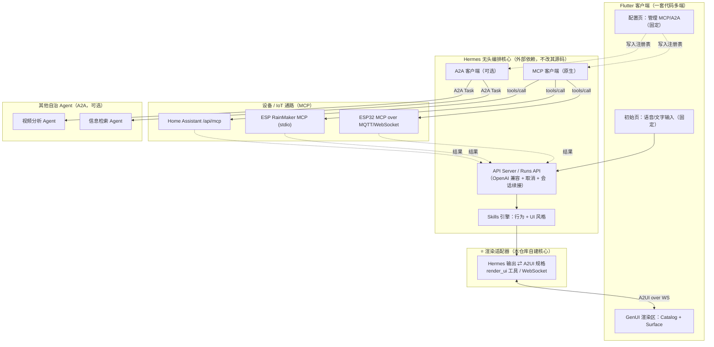

# AGENTS.md — Home Steward（智能家居管家）

> 本文件是本仓库的**单一事实源（Single Source of Truth）**。任何编码 Agent（Codex / Claude Code / 其他）在生成、修改代码前必须完整阅读本文件，并严格遵守"关键约束"与"务必 / 禁止"两节。

## 1. 项目使命（Mission）

构建一个**跨端智能家居管家应用**。用户通过语音或文字下达自然语言指令，系统理解意图后，编排下游设备与信息源完成任务，并将结果以**动态生成的原生界面**呈现。界面的视觉风格由用户**本地安装的技能（Skills）**决定。

目标安装端：**手机、电脑、TV、车机、智能眼镜 / XR**（覆盖度见 §3.4）。

核心交互范式：

1. 初始页 = 一个语音 / 文字输入框（固定代码）。
2. 配置页 = 管理已连接的下游能力（MCP 服务器 + 可选 A2A Agent，固定代码）。
3. 其余所有页面 = 运行时由编排核心按用户意图与已激活技能**动态生成**，以"UI 即数据"方式下发，由客户端渲染为原生 Widget。

## 2. 核心架构（Architecture）

系统分为**四层 + 三条协议总线**。务必区分三条总线的职责，不可混用：

- **A2UI / GenUI 总线**：编排核心 ⇄ 客户端，负责"界面即数据"的传输与状态同步。
- **MCP 总线**：编排核心 ⇄ 设备 / 工具，负责设备控制、数据与流地址获取（**设备走这条，非 A2A**）。
- **A2A 总线（可选）**：编排核心 ⇄ 其他**自治 Agent**，仅当下游本身是会自主推理的 Agent 时启用。



## 3. 技术栈与版本（Tech Stack）

> 标注 `⚠️待核实` 的版本号 / 命令请在生成时联网核对官方文档，不要假设。

### 3.1 编排核心：Hermes Agent（Nous Research）

- 形态：**无头后端**。以 OpenAI 兼容 HTTP 端点对外服务，带完整工具集（终端、文件、网络搜索、记忆、技能）。
- 关键接口：`POST /v1/chat/completions`（无状态，整段会话经 `messages` 传入）、**Runs API**（流式友好、支持 cancellation 与 session continuity）、`GET /health`。
- 配置文件：`hermes/config.yaml`（模型提供商、MCP 服务器、技能目录）。
- 技能目录：`~/.hermes/skills/`（遵循 agentskills.io 标准）。
- **本仓库不修改 Hermes 源码**，仅通过配置与 API 集成。

### 3.2 设备 / IoT 通路：MCP

| 通路 | 协议实现 | 传输 | 鉴权 |
|---|---|---|---|
| Home Assistant | 官方 `mcp_server` 集成，端点 `/api/mcp`，暴露 Assist API 为工具（**仅支持 Tools 子集**） | Streamable HTTP | OAuth 或长期访问令牌 |
| ESP RainMaker | 官方 MCP Server | stdio（本地） | RainMaker 账户 |
| ESP32 直连 | `xiaozhi-esp32`（McpServer::AddTool, JSON-RPC 2.0）或 `esp-mcp-over-mqtt` | WebSocket / MQTT 5.0 | MQTT topic 权限 |

- **传输归一**：因三者传输不一致，需在 `services/mcp_proxy/` 部署 `mcp-proxy` 或 MQTT broker 做 stdio ⇄ SSE/HTTP ⇄ MQTT 桥接。

### 3.3 生成式 UI：Flutter GenUI（首选）

- 三核心概念：**Catalog**（编译期暴露给 AI 的组件词汇表）、**Surface**（承载生成内容的区域）、**Conversation**（有状态对话循环）。
- 服务端集成走 **A2UI 协议**（`genui_a2a`，WebSocket）。
- ⚠️ GenUI 当前为 **alpha**，API 会有破坏性变更。**退路**：若 GenUI 不稳定，切换为 `rfw`（Remote Flutter Widgets，更稳定），仅需把 `render_ui` 输出格式从 A2UI JSON 换为 RFW blob，适配器其余逻辑不变。Catalog/组件目录的抽象层必须设计为**可切换渲染后端**。

### 3.4 多端覆盖现实（务必据此排期）

| 端 | 成熟度 | 实现路径 | 备注 |
|---|---|---|---|
| 手机 iOS/Android | ✅ 一等 | Flutter 原生 | 首发 |
| 电脑 Win/macOS/Linux | ✅ 稳定 | Flutter Desktop | 复用 |
| TV | ✅ 可行 | Android TV | 处理遥控器焦点导航 |
| 车机 | ✅ 有先例 | Flutter 嵌入式 embedder | 第二梯队 |
| 眼镜 / XR | ⚠️ 早期 | Android XR | **降级为"语音优先 + 单卡片"**，第三梯队 |

### 3.5 渲染适配器（自建）

- 语言：**Python**（与 Hermes/MCP 生态一致；如团队偏好 TypeScript 亦可，但需保持契约一致）。
- 职责：调用 Hermes API/Runs API；定义并拦截 `render_ui` 工具调用；将其 widget 树翻译为 A2UI 声明经 WebSocket 推送给客户端；回传客户端交互状态。

## 4. 关键约束（CRITICAL CONSTRAINTS — 不可违背的红线）

1. **Flutter 是 AOT 编译，禁止"运行时生成并编译 Dart 代码"。** 所有动态界面必须以**声明式数据**（A2UI / RFW blob）下发，由客户端预置组件渲染。绝不允许下发可执行代码并 eval。
2. **AI 只能使用 Catalog 中已编译的组件，不能发明新组件原语。** "风格由技能决定"指的是**组合方式、主题令牌、组件选用**的变化，而非新增渲染基元。Catalog 必须设计得丰富且高度可参数化（可换肤）。
3. **密钥绝不进客户端。** 所有模型 API Key、HA 长期令牌、OAuth secret 仅存在于 Hermes 或渲染适配器侧。客户端只持有面向适配器的会话凭证。
4. **不可逆设备动作必须经人工确认（HITL）。** 开锁、关空调、关闭安防等高影响操作，渲染适配器必须先下发"确认卡片"，得到用户显式确认后才真正执行 `tools/call`。
5. **导航与配置留在固定代码。** 动态生成只用于"页面内的内容区"，不得用于页面转场、路由或自定义绘制。
6. **设备 MCP 服务遵循"窄而专"粒度。** 单个 MCP server 尽量只负责一类功能，提升工具选择精度与可靠性。
7. **HA 的 MCP 仅支持 Tools**，不可依赖 Resources/Prompts/Sampling/Notifications。可用其实时状态快照。

## 5. 仓库结构（Repository Layout）

```
home-steward/
├── AGENTS.md                      # 本文件（单一事实源）
├── CLAUDE.md                      # Claude Code 入口（导入 AGENTS.md）
├── apps/
│   └── client_flutter/            # 多端客户端
│       ├── lib/
│       │   ├── main.dart
│       │   ├── pages/             # 固定页：input_page.dart, config_page.dart
│       │   ├── genui/
│       │   │   ├── catalog/       # 组件目录（编译期，可换肤）
│       │   │   ├── surface/       # GenUiSurface 封装
│       │   │   └── render_backend/# 渲染后端抽象（genui / rfw 可切换）
│       │   ├── agent/             # A2UI over WebSocket 连接
│       │   ├── config/            # MCP/A2A 注册表本地存储
│       │   ├── voice/             # 语音输入（STT）/ 语音播报（TTS）
│       │   └── platform/          # tv / car / xr 适配层
│       └── pubspec.yaml
├── services/
│   ├── render_adapter/            # ⭐ 渲染适配器（自建核心）
│   │   ├── src/render_adapter/
│   │   │   ├── server.py          # WS/HTTP 服务，A2UI emitter
│   │   │   ├── hermes_client.py   # 调用 Hermes API/Runs API
│   │   │   ├── render_ui.py       # render_ui 工具定义 + JSON Schema 校验
│   │   │   ├── translate.py       # Hermes tool-call ⇄ A2UI 声明
│   │   │   ├── hitl.py            # 不可逆动作的确认门控
│   │   │   └── tasks.py           # 中断/后台任务/完成回灌
│   │   └── pyproject.toml
│   └── mcp_proxy/                 # 传输归一（stdio<->SSE/HTTP, MQTT bridge）
├── hermes/
│   ├── config.yaml                # Hermes 配置（模型 + MCP servers）
│   └── skills/                    # 本地技能
│       ├── ui-style-minimal/SKILL.md
│       ├── ui-style-dashboard/SKILL.md
│       └── device-control-ha/SKILL.md
├── packages/
│   └── ui_spec/                   # 共享 UI-spec JSON Schema（客户端与适配器共用）
└── docs/
```

## 6. 接口契约（Interface Contracts — 最重要）

### 6.1 `render_ui` 工具（Hermes ⇄ 适配器的核心契约）

在 Hermes 侧注册一个名为 `render_ui` 的工具（或等效的输出 UI-spec 的技能）。Hermes 在 UI 风格技能引导下"调用"它来表达"要展示什么"；适配器拦截该调用并翻译为 A2UI。**Hermes 自身的 agentic 循环（记忆、技能、设备 MCP 工具调用）保持纯净，"渲染"统一收编进此工具调用。**

```json
{
  "name": "render_ui",
  "description": "Render a native UI on the user's current device surface. Call this INSTEAD of replying with plain text whenever a visual/interactive interface helps (device status, media, weather, lists, forms, confirmations). Compose the UI ONLY from the component catalog; you cannot invent new component types. Respect the currently active styleSkill.",
  "parameters": {
    "type": "object",
    "required": ["surfaceId", "root"],
    "properties": {
      "surfaceId": { "type": "string", "description": "目标渲染区，默认 'main'" },
      "styleSkill": { "type": "string", "description": "当前激活的 UI 风格技能名" },
      "root": { "$ref": "#/$defs/node" }
    },
    "$defs": {
      "node": {
        "type": "object",
        "required": ["component"],
        "properties": {
          "component": {
            "type": "string",
            "description": "Catalog 中的组件名，如 WeatherCard / DeviceTile / MediaPlayer / InfoCard / ListView / ConfirmDialog"
          },
          "props": { "type": "object", "description": "组件属性，须匹配该组件 schema" },
          "bindings": {
            "type": "object",
            "description": "数据绑定：将 props 绑定到 DataContext 路径，支持交互回流"
          },
          "events": {
            "type": "object",
            "description": "事件 → 回传给 Hermes 的动作名，如 {'onTap': 'device.toggle'}"
          },
          "children": {
            "type": "array",
            "items": { "$ref": "#/$defs/node" }
          }
        }
      }
    }
  }
}
```

### 6.2 客户端 Catalog 组件（最小集，编译期内置）

每个组件必须提供 `name` + JSON Schema + builder。最小集（首期）：

- `InfoCard`（title, body）
- `WeatherCard`（location, temp, condition, hourly[]）
- `DeviceTile`（name, state, type, controllable）— 设备开关/调节
- `MediaPlayer`（streamUrl, poster, type=video|audio）— 承载摄像头流 / 视频
- `MetricChart`（series, kind）— 数据可视化
- `ListView` / `Row` / `Column` / `Section`（布局）
- `ConfirmDialog`（message, confirmAction, cancelAction）— **HITL 确认专用**
- `TextInput` / `Slider` / `Toggle`（交互，状态回流）

> 所有可视组件须支持 `theme` 参数以接受技能下发的主题令牌（实现"换肤"）。

### 6.3 UI 风格技能模板（`SKILL.md`）

```markdown
---
name: ui-style-minimal
description: 极简卡片界面风格。当需要向用户展示天气、设备状态、媒体、信息或确认卡片时，使用本风格渲染——强调留白、单列、大字号、低信息密度。Use when rendering weather, device, media, info, or confirmation UIs in a minimal aesthetic.
---

# 极简卡片风格

## 主题令牌（Theme Tokens）
- color.background: "#0B0B0F"
- color.surface: "#16161D"
- color.accent: "#7C5CFF"
- radius.card: 20
- spacing.base: 16
- font.scale: 1.15

## 布局规则
- 单列优先；每屏主卡片不超过 3 张。
- 大留白；卡片圆角统一使用 radius.card。

## 组件选用映射
- 天气 → WeatherCard（variant: "large"）
- 设备 → DeviceTile（variant: "toggle"）
- 视频/摄像头 → MediaPlayer（variant: "fullbleed"）
- 列表信息 → ListView + InfoCard

## render_ui 输出约束
- 调用 render_ui 时，styleSkill 字段填 "ui-style-minimal"。
- 每个可视节点的 props.theme 注入上述主题令牌。
- 模板片段见 assets/templates/*.json
```

### 6.4 配置页：能力注册表（Capability Registry）

- **MCP 服务器条目**：`{ id, name, transport(http|stdio|mqtt), endpoint, auth(oauth|token|none), credentialRef }`。
- **A2A Agent 条目（可选）**：拉取远程 **Agent Card**（JSON，含 name/description/version/endpoint/skills/auth），展示其声明的技能供用户授权后纳入可调度池。
- 注册表持久化于客户端本地（如 `shared_preferences` / 本地文件），凭证仅存引用，真实 secret 存适配器侧。

## 7. 交互模式（可打断 / 后台任务 / HITL）

实现第一性需求"执行中被打断 → 即时回答 → 旧任务转后台 → 完成后汇报"：

- 利用 Hermes **Runs API 的 cancellation 与 session continuity**。
- 在 `services/render_adapter/tasks.py` 实现：中断检测（安全边界）、意图仲裁、任务快照、HITL 选择门控、后台续跑、完成事件回灌（向 Surface 注入完成卡片）。
- 长任务（盯摄像头、下载录像）转后台时返回 `task_id`，完成后经 watcher 触发新一轮 turn 主动汇报。

## 8. 编码规范（Conventions）

### Flutter / Dart

- 状态管理：统一使用 `Riverpod`（或团队既有方案，全仓库一致）。
- 目录即特性（feature-first）；UI 与数据层分离。
- 所有 Catalog 组件必须有 widget 测试 + golden test。
- 禁止在 widget 中直接放置业务逻辑或网络调用。

### Python（适配器）

- 使用 `uv` 管理依赖；`ruff` 做 lint + format；类型注解齐全，`mypy` 通过。
- A2UI 输出前必须经 `packages/ui_spec` 的 JSON Schema 校验，校验失败则降级为纯文本卡片并记录日志。

### 通用

- 提交信息遵循 Conventional Commits。
- 任何外部命令/版本号若不确定，先联网核实再写入代码，禁止臆造。

## 9. 构建 / 运行 / 测试（Commands）

```bash
# —— Flutter 客户端 ——
cd apps/client_flutter
flutter pub get
flutter run -d <device_id>          # 开发
flutter test                        # 单测 + golden
flutter build apk / ipa / windows / macos / linux

# —— 渲染适配器 ——
cd services/render_adapter
uv sync
uv run python -m render_adapter.server   # 启动 WS/HTTP 服务
uv run pytest

# —— Hermes（外部依赖）——
# ⚠️待核实：以官方文档为准，启动 API Server 并加载 hermes/config.yaml 与 skills/
# 验证端点：
curl http://<hermes-host>/v1/chat/completions \
  -H "Authorization: Bearer $HERMES_API_KEY" \
  -H "Content-Type: application/json" \
  -d '{"model":"hermes-agent","messages":[{"role":"user","content":"Hello"}]}'

# —— MCP 传输代理 ——
cd services/mcp_proxy && <按所选 mcp-proxy / MQTT broker 启动>
```

## 10. 安全与隐私（Security）

- 密钥仅在服务端；客户端通过短期会话令牌访问适配器。
- 设备动作最小权限：仅操作 HA "已暴露实体"范围内的设备。
- 技能安全审查：仅安装来源可信的 Skill；含 `scripts/` 的技能需人工审阅后启用。
- 不可逆动作强制 HITL（见 §4.4）。
- 全链路操作审计日志（谁、何时、对哪个设备、做了什么、成本）。

## 11. 开发路线图（Milestones — 按此顺序生成）

1. **M1** 启动 Hermes API Server（无头），用 curl 验证 OpenAI 兼容端点、Runs API、取消能力。
2. **M2** 接第一条设备 MCP 通路：经 HA `/api/mcp`（长期令牌）控制一盏灯，再扩展 RainMaker / ESP32-over-MQTT。
3. **M3** 写渲染适配器 + 最小 GenUI Catalog（InfoCard/ListView/MediaPlayer/DeviceTile/ConfirmDialog），打通 Hermes→适配器→GenUI 固定风格渲染。
4. **M4** 引入第一个 UI 风格技能，验证"激活技能即换肤"。
5. **M5** 补固定的输入页与配置页（能力注册表）。
6. **M6** 叠加中断/后台任务 + HITL 确认。
7. **M7** 扩展 TV/车机；眼镜端降级为"语音优先 + 单卡片"。

## 12. 务必 / 禁止（DO / DON'T for the Agent）

**DO**

- 修改代码前先读本文件与相关模块的局部 README。
- 保持 `render_ui` 契约与 `packages/ui_spec` schema 双向一致。
- 渲染后端做成可切换抽象（GenUI ↔ RFW）。
- 为每个 Catalog 组件与每条 MCP 通路补测试。

**DON'T**

- ❌ 不要尝试运行时编译/执行 Dart 或下发可执行代码。
- ❌ 不要新增 Catalog 之外的渲染基元来"满足"技能风格。
- ❌ 不要把任何 secret 写入客户端或提交进仓库。
- ❌ 不要让设备 MCP 控制走 A2A；设备走 MCP，A2A 仅用于自治 Agent。
- ❌ 不要修改 Hermes 上游源码；只通过配置与 API 集成。

## 13. 术语表（Glossary）

- **A2UI**：UI 蓝图跨信任边界传输的协议（UI 即数据）。
- **MCP**：Model Context Protocol，Agent ⇄ 工具/设备 的标准化访问。
- **A2A**：Agent2Agent，Agent ⇄ Agent 的任务委派协议（Linux 基金会托管）。
- **Catalog / Surface / Conversation**：Flutter GenUI 三核心概念。
- **Skill**：agentskills.io 标准的能力包（SKILL.md + 可选 scripts/references/assets），本项目中同时承载"行为"与"UI 风格"。
- **HITL**：Human-in-the-Loop，人在环确认。
